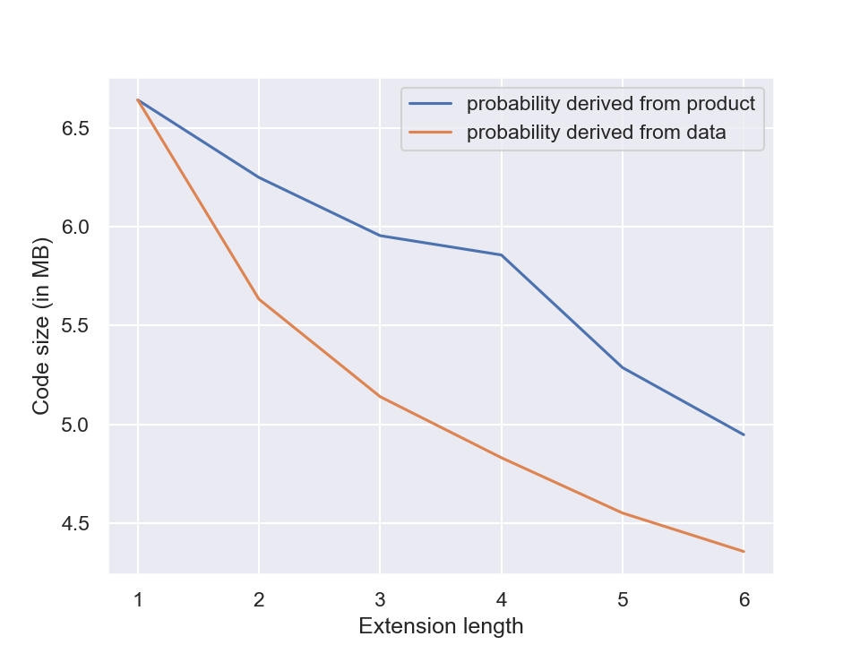
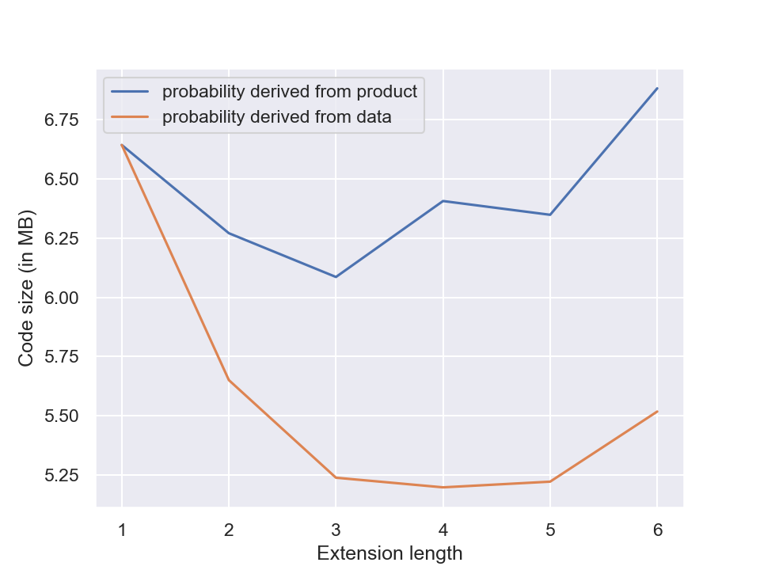
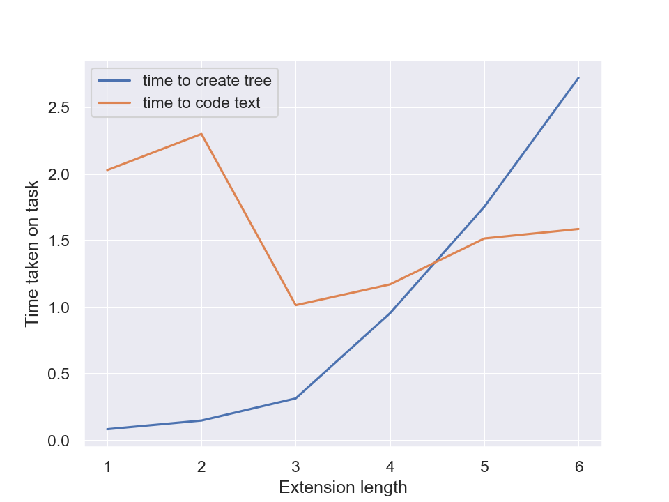

# Projekt: Kodowanie Huffmana
Projekt zawiera moje implementacje i benchmarki wariantów kodowania Huffmana.

Zaimplementowano:
1. Naiwne kody Huffmana (niekanoniczne)
2. Kanoniczne kody Huffmana (tworzenie słów kodowych bez użycia drzew)
3. Rozszerzone kody Huffmana

Testy przeprowadzono na danych:
1. Książki (dane typowe, które często chcemy kompresować):
    * a) Alice in Wonderland
    * b) Moby Dick or The Whale
    * c) Beyond Good and Evil
2. Dane (dane z których korzystałem i ich rozmiar przysporzył mi kłopotu):
    * a) podzbiór 20000 wektorów słów word2vec

## Instrukcja obsługi
#### Interfejs w Pythonie
Wysokopoziomy interfejs w Pythonie dostępny jest w pliku `huffman.py`.

Mając tekst w postaci zmiennej `text` do zakodowania, możemy użyć:
* `code, codebook = huffman.ambigous(text)`
* `code, codebook = huffman.canonical(text)`
* `code, codebook = huffman.extended(text, block_length=2)`

Chcąc odkodować zakodowany tekst w postaci zmiennej `code` i `codebook`:
* `text = huffman.decode(code, codebook)`

#### Interfejs poza Pythonem
Chcąc eksportować zakodowane pliki, można wywołać w terminalu:
* `python encode.py inputname.txt foldername`

Zakodowana wersja tekstu z `inputname.txt` zostanie zapisana w folderze `foldername`. Do kodowania zostanie użyty algorytm rozszerzonych kodów Huffmana o ciągach długości 2.

Chcąc odkodować kod zakodowany z folderu `foldername`:
* `python decode.py foldername`

## Kanoniczne kodowanie Huffmana
To ustandaryzowane kodowanie Huffmana, w którym to, jaki kod będzie miał zadany kod, jest jednoznaczne. W przypadku kodów niekanonicznych nie musi tak być, gdyż nie jest określone co robić w przypadku remisów. Ponadto w tym wariancie kodów Huffmana wariancja słów kodowych jest najmniejsza, tzn. preferujemy kody równej długości ponad kody różnej długości. 

| kodowanie   | roz. słownika | najkr. słowo | wariancja |
| ---:        | :---: | :---: | --- |
| niekanoniczne  | 117 | 2 | 35.39 |
| kanoniczne     | 117 | 4 | 35.24 |

Jak widać, w przypadku tego zbioru danych (2a) różnica w wariancji jest naprawdę niewielka. Zgadza się jednak, że w przypadku wersji kanonicznej wariancja jest mniejsza, a długość kodów wyrównana między słowami.

| Tytuł | roz. org. | roz. komp. | rozsz. o dł. 2 |
| ---: | :---: | :---: | :---: |
| Alice in Wonderland | 145.1 kB | 82.6 kB | 72.9 + 12.2 kB |
| Beyond Good and Evil | 785.8 kB | 225.5 kB | 201.1 + 20.3 kB |
| Moby Dick or the Whale | 2418.5 kB | 684.2 kB | 612.0 + 22.4 kB |
| Wektory word2vec 20k   | 15.3 MB | 6.6 MB | 5.6 + 0.1 MB |
> Wyniki kompresji na różnych rodzajach danych. W przypadku niewielkich danych, kody rozszerzone mogą działać gorzej niż kody nierozszerzone. Jednak nawet zwykłe kodowanie Huffmana pozwala na zadowalającą kompresję danych.

## Rozszerzone kodowanie Huffmana
W tym wariancie kodujemy nie symbole, a krótkie ciągi symboli. Ustalamy długość _K_ ciągu symboli która będzie kodowana i z takich ciągów tworzymy słownik. Możemy liczyć wystąpienia ciągów długości _K_ w dokumencie lub użyć liczby wystąpień poszczególnych symboli, zakładając że występują niezależnie od siebie. Porównuję oba te podejścia.

> Wykres przedstawia porównanie rozmiaru zakodowanych danych (2a) wygenerowanego przez opisane wyżej podejścia. Generowanie prawdopodobieństw ciągu przez założenie, że symbole występują niezależnie od siebie sprawdza się wyraźnie gorzej, niż wyciągnięcie tych prawdopodobieństw z danych.

Jak widać, im dłuższe ciągi, tym mniejszy rozmiar danych po zakodowaniu. Gdyby rozmiar ciągów ustalić na równy długości zadanych danych, otrzymalibyśmy kod długości 1. Taka kompresja jednak nas nie interesuje, bo sam algorytm kodowania musiałby być rozmiaru danych wejściowych. Po uwzględnieniu rozmiaru mapy kodującej słowa wejściowe, wykres ulega zmianie.

> Wykres przedstawia porównanie rozmiaru zakodowanych danych (2a) wraz z mapą kodową potrzebną do kodowania i odkodowania danych. Różnica pomiędzy podejściami do prawdopodobieństw jest jeszcze bardziej widoczna.

Oczywiście wraz z wzrostem długości danych wejściowych, zmniejsza się to procentowy udział rozmiaru mapy kodującej. W przypadku bardzo dużych danych ciągi większej długości mogą mieć sens. W naszym przypadku ciągi długości 3-4 były optymalne.

### Czas działania
Tworzenie słów kodowych z ciągów symboli zamiast pojedynczych symboli wiąże się ze wzrostem czasu koniecznego do stworzenia drzewa kodowego. W takim drzewie jest bowiem znacznie więcej liści. O ile samych symboli może być niewiele, ich liczba rośnie wykładniczo wraz z wzrostem długości ciągu.

> Wraz ze wzrostem długości ciągu, w przybliżeniu wykładniczo rośnie czas konieczny do zbudowania drzewa kodowego (niebieski wykres). Z drugiej strony nieznacznie może zmniejszyć się czas konieczny na zakodowanie danych, chociaż nie zmienia się on asymptotycznie. To dlatego, że rozważając ciągi symboli, mamy mniej elementów do zakodowania.

Ważnym wnioskiem jest, że nie istnieje optymalny dobór parametrów. O ile rozszerzone kody w teorii działają dobrze, w praktyce zauważalnie zwiększają czas działania algorytmu. Sama ich efektywność zależy od rozmiaru danych do zakodowania -- im jest on większy, tym bardziej opłaci się używanie ciągów o dużych długościach. W przypadku danych o niewielkich rozmiarach, może być lepiej nie używać kodów rozszerzonych a pozostać przy kodach kanonicznych. Kody kanoniczne mają sporo zalet: nie wydłużają czasu potrzebnego do kodowania i dekodowania, standaryzują algorytm i dają najbardziej zrównoważone kody. To ostatnie może mieć znaczenie w przypadku efektywnych implementacji kodowania Huffmana, kiedy duże nierówności między długościami słów kodowych mogą przeszkadzać.